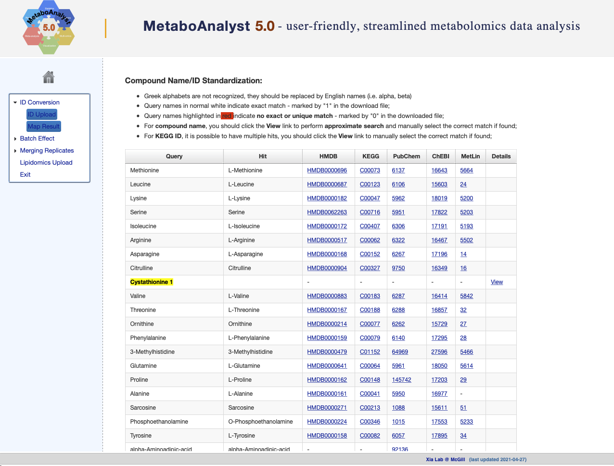

**Compiled date**: `r Sys.Date()`

**Last edited**: 2024-02-10

**License**: `r packageDescription("fobitools")[["License"]]`

```{r, include = FALSE}
knitr::opts_chunk$set(
  collapse = TRUE,
  comment = "#>"
)
```

# Installation

Run the following code to install the Bioconductor version of the package.        

```{r, eval = FALSE}
if (!requireNamespace("BiocManager", quietly = TRUE))
    install.packages("BiocManager")

BiocManager::install("fobitools")
```

# Load packages 

```{r, warning = FALSE, message = FALSE, comment = FALSE}
library(fobitools)
```

We will also need some additional [CRAN](https://cran.r-project.org) and [Bioconductor](https://bioconductor.org) packages for performing tasks such as statistical analysis.   

```{r, warning = FALSE, message = FALSE, comment = FALSE}
# CRAN
library(tidyverse)
library(ggrepel)
library(kableExtra)

# Bioconductor
library(POMA)
library(metabolomicsWorkbenchR)
library(SummarizedExperiment)
```

# Download the data from Metabolomics Workbench

The Metabolomics Workbench, available at [www.metabolomicsworkbench.org](www.metabolomicsworkbench.org), is a public repository for metabolomics metadata and experimental data spanning various species and experimental platforms, metabolite standards, metabolite structures, protocols, tutorials, and training material and other educational resources. It provides a computational platform to integrate, analyze, track, deposit and disseminate large volumes of heterogeneous data from a wide variety of metabolomics studies including mass spectrometry (MS) and nuclear magnetic resonance spectrometry (NMR) data spanning over 20 different species covering all the major taxonomic categories including humans and other mammals, plants, insects, invertebrates and microorganisms [@sud2016metabolomics].    

The `metabolomicsWorkbenchR` Bioconductor package allows us to obtain data from the Metabolomics Workbench repository. In this vignette we will use the sample data set [ST000629](https://www.metabolomicsworkbench.org/data/DRCCMetadata.php?Mode=Study&StudyID=ST000629). 

## Sumary of the study (ST000629)

The objective of the study is to identify changes of urinary metabolite profiles associated with different responses to blood pressure to salt. Subjects are derived from The Dietary approaches to stop hypertension (DASH) diet, Sodium Intake and Blood Pressure Trial (Sacks FM _et al_ PMID: 11136953,N Engl J Med. 2001).We choose two groups subjects who meet the following conditions (the two groups are separately named A and B). We chose subjects on the Control diet. These subjects meet the blood pressure criteria described below:Group A subjects conditions: 1) On Control diet. 2) Normotensive subjects: systolic blood pressure from the low sodium visit is less than 140 and the diastolic blood pressure from low sodium visit is less than 90; 3) For group A: Either the systolic blood pressure from the high sodium visit was greater than 10 mmHg higher than the systolic blood pressure from the low sodium visit, or the diastolic blood pressure from the high sodium visit was greater than 10 mmHg higher than the diastolic blood pressure from the low sodium visit; 3) For group B: The systolic blood pressure from the high sodium visit is within 5 mmHg (i.e. +/- 5) from the systolic blood pressure from the low sodium visit, and the diastolic blood pressure from the high sodium visit is within 5 mmHg from the diastolic blood pressure from the low sodium visit. Use gas chromatography/mass spectrometry (GC/MS) analysis, and liquid chromatography/mass spectrometry (LC/MS) analysis to find the differences of metabolic profiles between the high sodium level and the low sodium level, and compare the metabolic profiles of A with the metabolic profiles of B at the low and high sodium level.

## Download data

This study includes compounds analyzed via MS analysis and positive ion mode (AN000961). Let's download it!   

```{r, warning = FALSE, message = FALSE, comment = FALSE}
data <- do_query(
  context = "study",
  input_item = "analysis_id",
  input_value = "AN000961",
  output_item = "SummarizedExperiment")
```

# Prepare features and metadata

Now we have to prepare the metadata and features in order to proceed with the statistical analysis. In this step we assign to each metabolite its chemical name provided in Metabolomics Workbench.

```{r, warning = FALSE, message = FALSE, comment = FALSE}
## features 
features <- assay(data)
rownames(features) <- rowData(data)$metabolite

## metadata
pdata <- colData(data) %>%
  as.data.frame() %>%
  tibble::rownames_to_column("ID") %>%
  relocate(grouping, .before = Sodium.level) %>%
  mutate(grouping = case_when(grouping == "A(salt sensitive)" ~ "A",
                              grouping == "B(salt insensitive)" ~ "B"))
```

# Statistical analysis with `POMA`

`POMA` provides a structured, reproducible and easy-to-use workflow for the visualization, preprocessing, exploration, and statistical analysis of metabolomics and proteomics data. The main aim of this package is to enable a flexible data cleaning and statistical analysis processes in one comprehensible and user-friendly R package. `POMA` uses the standardized `MSnbase` data structures, to achieve the maximum flexibility and reproducibility and makes `POMA` compatible with other Bioconductor packages [@POMA].

## Create a `SummarizedExperiment` object

First, we create a `SummarizedExperiment` object that integrates both metadata and features in the same data structure.

```{r, warning = FALSE, message = FALSE, comment = FALSE}
data_sumexp <- PomaCreateObject(metadata = pdata, features = t(features))
```

## Preprocessing

Second, we perform the preprocessing step. This step includes the missing value imputation using the $k$-NN algorithm, log Pareto normalization (transformation and scaling) and outlier detection and cleaning. Once these steps are completed, we can proceed to the statistical analysis of these data.

```{r, warning = FALSE, message = FALSE, comment = FALSE}
data_preprocessed <- data_sumexp %>%
  PomaImpute() %>%
  PomaNorm() %>%
  PomaOutliers(coef = 3) %>% 
  magrittr::extract2("data")
```

## Limma model

We use a limma model [@limma] to identify those most significant metabolites between the "**A(salt sensitive)**" and "**B(salt insensitive)**" groups. 

```{r, warning = FALSE, message = FALSE, comment = FALSE}
limma_res <- data_preprocessed %>%
  PomaLimma(contrast = "A-B", adjust = "fdr") %>%
  dplyr::rename(ID = feature)

# show the first 10 features
limma_res %>%
  dplyr::slice(1L:10L) %>%
  kbl(row.names = FALSE, booktabs = TRUE) %>%
  kable_styling(latex_options = c("striped"))
```

## Convert metabolite names to KEGG identifiers with `MetaboAnalyst` web server

In many metabolomics studies, the reproducibility of analyses is severely affected by the poor interoperability of metabolite names and their identifiers. For this reason it is important to develop tools that facilitate the process of converting one type of identifier to another. In order to use the `fobitools` package, we need some generic identifier (such as PubChem, KEGG or HMDB) that allows us to obtain the corresponding FOBI identifier for each metabolite. However, unlike vignette "_Use case ST000291_", the Metabolomics Workbench repository does not provide us with this information for the metabolites quantified in study [ST000629](https://www.metabolomicsworkbench.org/data/show_metabolites_by_study.php?STUDY_ID=ST000629&SEARCH_TYPE=KNOWN&STUDY_TYPE=MS&RESULT_TYPE=1).    

In those cases where we do not have other common identifiers, the authors recommend using the powerful conversion tool provided by [MetaboAnalyst](https://www.metaboanalyst.ca/MetaboAnalyst/upload/ConvertView.xhtml). This tool will allow us to move from the metabolite names to other generic identifiers such as KEGG or HMDB, which will later allow us to obtain the FOBI identifier of these metabolites.

In order to use the MetaboAnalyst ID conversion tool, we can copy the result of the following `cat()` command and paste it directly into MetaboAnalyst (Figure \@ref(fig:MAconvertID)). 

```{r, warning = FALSE, message = FALSE, comment = FALSE, eval = FALSE}
cat(limma_res$ID, sep = "\n")
```

```{r MAconvertID, message = FALSE, warning = FALSE, comment = FALSE, echo = FALSE, fig.align = "center", out.width = "100%", fig.cap = 'Metabolite names conversion using MetaboAnalyst.'}

```

Then, we can access to the MetaboAnalyst temporary page that is hosting our results (where the following "_XXXXXXX_" will be your guest URL).  

```{r, warning = FALSE, message = FALSE, comment = FALSE, eval = FALSE}
ST000629_MetaboAnalyst_MapNames <- readr::read_delim("https://www.metaboanalyst.ca/MetaboAnalyst/resources/users/XXXXXXX/name_map.csv", delim = ",")
```

```{r, warning = FALSE, message = FALSE, comment = FALSE, echo = FALSE}
load("data/ST000629_MetaboAnalyst_MapNames.rda")
```

# Convert KEGG IDs to FOBI IDs

Once we have the results of the statistical analysis and generic identifiers recognized in the FOBI ontology [@castellano2020fobi], we can proceed to perform one of the main functions provided by the `fobitools` package, the ID conversion. With the `fobitools::id_convert()` command, users can convert different IDs between FOBI, HMDB, KEGG, PubChem, InChIKey, InChICode, ChemSpider, and chemical names. We will then obtain the FOBI IDs from the KEGG IDs (obtained in the previous section via MetaboAnalyst web server) and add them as a new column to the results of the limma model.

```{r, warning = FALSE, message = FALSE, comment = FALSE}
annotated_limma <- ST000629_MetaboAnalyst_MapNames %>%
  dplyr::rename(ID = Query) %>%
  right_join(limma_res, by = "ID")

limma_FOBI_names <- annotated_limma %>%
  dplyr::pull("KEGG") %>%
  fobitools::id_convert(to = "FOBI")

# show the ID conversion results
limma_FOBI_names %>%
  head() %>%
  kbl(row.names = FALSE, booktabs = TRUE) %>%
  kable_styling(latex_options = c("striped"))
```

```{r, warning = FALSE, message = FALSE, comment = FALSE}
limma_FOBI_names <- limma_FOBI_names %>%
  right_join(annotated_limma, by = "KEGG") %>%
  dplyr::select(FOBI, KEGG, ID, logFC, P.Value, adj.P.Val) %>%
  dplyr::arrange(-dplyr::desc(P.Value))
```

# Enrichment analysis

Enrichment analysis denotes any method that benefits from biological pathway or network information to gain insight into a biological system [@creixell2015pathway]. In other words, these type of analyses integrate the existing biological knowledge (from different biological sources such as databases and ontologies) and the statistical results of _omics_ studies, obtaining a deeper understanding of biological systems.  

In most metabolomics studies, the output of statistical analysis is usually a list of features selected as statistically significant or statistically relevant according to a pre-defined statistical criteria. Enrichment analysis methods use these selected features to explore associated biologically relevant pathways, diseases, etc., depending on the nature of the input feature list (genes, metabolites, etc.) and the source used to extract the biological knowledge (GO, KEGG, **FOBI**, etc.).    

Here, we present a tool that uses the FOBI information to perform different types of enrichment analyses. Therefore, the presented methods allow researchers to move from lists of metabolites to chemical classes and food groups associated with those lists, and consequently, to the study design. 

Currently, the most popular used approaches for enrichment analysis are the over representation analysis (ORA) and the gene set enrichment analysis (GSEA), with its variants for other fields such as the metabolite set enrichment analysis (MSEA) [@xia2010msea].

## Over representation analysis (ORA)

ORA is one of the most used methods to perform enrichment analysis in metabolomics studies due to its simplicity and easy understanding. This method statistically evaluates the fraction of metabolites in a particular pathway found among the set of metabolites statistically selected. Thus, ORA is used to test if certain groups of metabolites are represented more than expected by chance given a feature list. 

However, ORA has a number of limitations. The most important one is the need of using a certain threshold or criteria to select the feature list. This means that metabolites do not meet the selection criteria must be discarded. The second big limitation of ORA is that this method assumes independence of sets and features. In ORA, is assumed that each feature is independent of the other features and each set is independent of the other sets.

Here, we perform an ORA with the `fobitools` package, where we will use as a universe all the metabolites of the study present in FOBI and as a list those metabolites with a raw p-value < 0.05 in the limma results table.

```{r, warning = FALSE, message = FALSE, comment = FALSE}
metaboliteList <- limma_FOBI_names$FOBI[limma_FOBI_names$P.Value < 0.05]
metaboliteUniverse <- limma_FOBI_names$FOBI

fobitools::ora(metaboliteList = metaboliteList,
               metaboliteUniverse = metaboliteUniverse,
               pvalCutoff = 1) %>%
  kbl(row.names = FALSE, booktabs = TRUE) %>%
  kable_styling(latex_options = c("striped"))
```

<!-- As we can see, due to the limitations of this methodology and the small number of metabolites that meet the set statistical criterion, the results do not show a clear and obvious relationship with the design of the study, as the food groups that appear in the ORA results do not correspond to those foods administered in the intervention. -->

## MSEA

Gene Set Enrichment Analysis (GSEA) methodology was proposed for the first time in 2005, with the aim of improving the interpretation of gene expression data. The main purpose of GSEA is to determine whether members of a gene set $S$ tend to occur toward the top (or bottom) of the gene list $L$, in which case the gene set is correlated with the phenotypic class distinction [@subramanian2005gene]. 

This type of analysis basically consists of three key steps [@subramanian2005gene]: 

The first step consists on the calculation of an enrichment score ($ES$). This value indicates the degree to which a set $S$ is overrepresented at the extremes (top or bottom) of the entire ranked gene list $L$. The $ES$ is calculated by walking down the list $L$, increasing a running-sum statistic when a gene is found in $S$ and decreasing it when a gene is not found in $S$. The magnitude of the increment depends on the correlation of the gene with the phenotype. The $ES$ is the maximum deviation from zero encountered in the random walk. 

The second step is the estimation of significance level of $ES$. The statistical significance (nominal p-value) of the $ES$ is estimated by using an empirical phenotype-based permutation test that preserves the complex correlation structure of the gene expression data. The phenotype labels ($L$) are permuted and the $ES$ of the $S$ is recomputed for the permuted data, which generates a null distribution for the $ES$. The empirical, nominal p-value of the observed $ES$ is then calculated relative to this null distribution. The permutation of class labels (groups) preserves gene-gene correlations and, thus, provides a more biologically reasonable assessment of significance than would be obtained by permuting genes.

Finally, the third step consist on the adjustment for multiple hypothesis testing. When an entire database of gene sets is evaluated, the estimated significance level is adjusted for multiple hypothesis testing. First, the $ES$ is normalized for each gene set to account for the size of the set, yielding a normalized enrichment score (NES). Then, the proportion of false positives is controlled by calculating the FDR corresponding to each NES. 

In 2010, a modification of the GSEA methodology was presented for metabolomics studies. This method was called Metabolite Set Enrichment Analysis (MSEA) and its main aim was to help researchers identify and interpret patterns of human and mammalian metabolite concentration changes in a biologically meaningful context [@xia2010msea]. MSEA is currently widely used in the metabolomics community and it is implemented and freely available at the known [MetaboAnalyst](https://www.metaboanalyst.ca) web-based tool [@xia2010msea].

As can be seen, GSEA approach is more complex than the ORA methodology, both in terms of methodological aspects and understanding of the method.

The `fobitools` package provides a function to perform MSEA using the FOBI information. This function requires a ranked list. Here, we will use the metabolites obtained in the limma model ranked by raw p-values.  

```{r, warning = FALSE, message = FALSE, comment = FALSE}
limma_FOBI_msea <- limma_FOBI_names %>%
  select(FOBI, P.Value) %>%
  filter(!is.na(FOBI)) %>%
  dplyr::arrange(-dplyr::desc(abs(P.Value)))

FOBI_msea <- as.vector(limma_FOBI_msea$P.Value)
names(FOBI_msea) <- limma_FOBI_msea$FOBI

msea_res <- fobitools::msea(FOBI_msea, pvalCutoff = 1)

msea_res %>%
  kbl(row.names = FALSE, booktabs = TRUE) %>%
  kable_styling(latex_options = c("striped"))
```

### MSEA plot with `ggplot2`

```{r, warning = FALSE, message = FALSE, comment = FALSE, fig.width = 12, fig.height = 8}
ggplot(msea_res, aes(x = -log10(pval), y = NES, color = NES, size = classSize, label = className)) +
  xlab("-log10(P-value)") +
  ylab("NES (Normalized Enrichment Score)") +
  geom_point() +
  ggrepel::geom_label_repel(color = "black", size = 7) +
  theme_bw() +
  theme(legend.position = "top",
        text = element_text(size = 22)) +
  scale_color_viridis_c() +
  scale_size(guide = "none")
```

### Network of metabolites found in MSEA

```{r, warning = FALSE, message = FALSE, comment = FALSE, fig.width = 12, fig.height = 10}
FOBI_terms <- msea_res %>%
  unnest(cols = leadingEdge)

fobitools::fobi %>%
  filter(FOBI %in% FOBI_terms$leadingEdge) %>%
  pull(id_code) %>%
  fobi_graph(get = "anc",
             labels = TRUE,
             legend = TRUE,
             labelsize = 6,
             legendSize = 20)
```

# Limitations

The FOBI ontology is currently in its first release version, so it does not yet include information on many metabolites and food relationships. All future efforts will be directed at expanding this ontology, leading to a significant increase in the number of metabolites and metabolite-food relationships. The `fobitools` package provides the methodology for easy use of the FOBI ontology regardless of the amount of information it contains. Therefore, future FOBI improvements will also have a direct impact on the `fobitools` package, increasing its utility and allowing to perform, among others, more accurate, complete and robust enrichment analyses.

# Session Information

```{r}
sessionInfo()
```

# References

